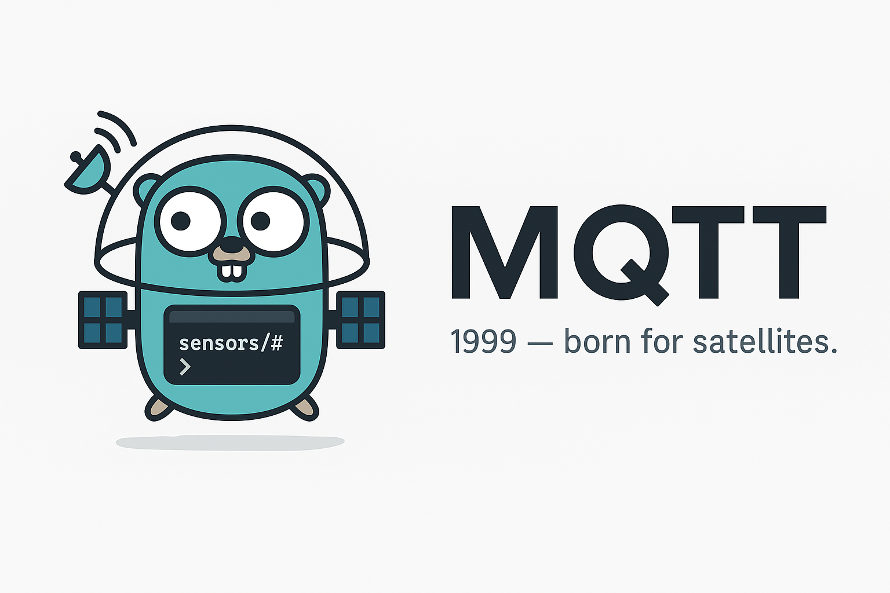
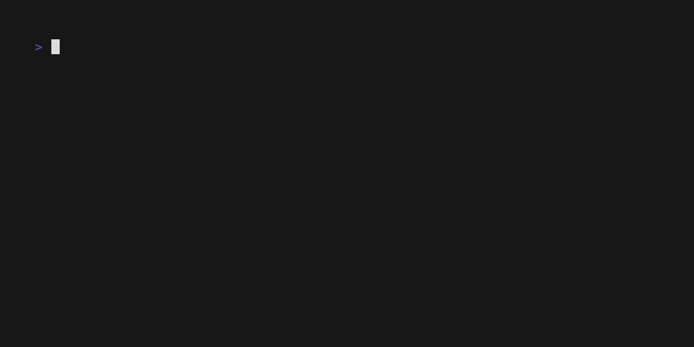

# Emqutiti



Emqutiti is a polished MQTT client for the terminal built on
[Bubble Tea](https://github.com/charmbracelet/bubbletea). Profiles live in
`~/.config/emqutiti/config.toml` so you can switch brokers with a few key presses.

## The short demo below shows the app in action.

### Add a new connection


### Connect to broker, add new topic, create message


## Features

- Slick interface for publishing and subscribing
- Manage multiple brokers with one config file
- Credentials stored securely via the OS keyring
- Import CSV files with a friendly wizard
- Persistent history and trace recording, even headless

## Installation
### From Source
```bash
go install github.com/marang/emqutiti/cmd/emqutiti@latest
```

### Arch Linux
```bash
yay -S emqutiti
```

## Usage

```bash
emqutiti
```

If a profile is marked as default, the app connects to it automatically on start.

### Interactive workflow

- In the topic input, `Enter` adds and subscribes to a new topic. On a
  topic chip, `Enter` toggles subscription, `p` toggles the publish target,
  and `Delete` opens a removal confirmation. Typing in inputs or list
  filters does not run chip commands.
- With the message editor focused, `Ctrl+Enter` publishes and
  `Ctrl+Shift+Enter` publishes retained. On macOS, use `Cmd+Enter` and
  `Cmd+Shift+Enter`; the Ctrl combinations also work. Plain `Enter` inserts a
  newline. The terminal must send distinct modified-key sequences; see
  [terminal shortcut compatibility](help/help.md#terminal-shortcut-compatibility).
  Explicit publish targets take priority; otherwise the selected
  topic is used. MQTT work runs asynchronously, keeping the UI responsive.
- The Message footer keeps publish, retained and newline shortcuts visible
  regardless of focus. It wraps on narrow terminals without reducing the
  configured editor rows.
- Pending publishes show their original targets and suppress repeat sends
  until the current batch finishes. Each request keeps its payload, target,
  retain flag and broker/client snapshot; the draft remains editable and is
  not cleared on completion. Results from an old connection are ignored.
- History entries, saved payloads and success pulses follow successful MQTT
  API results per target. Failures appear in history and the message context;
  successful targets in a partially failed batch are still recorded.
  **QoS 0 API success does not confirm subscriber delivery.**
- Payload `Delete` and right-click require confirmation for the chosen
  entry, even if the list changes while the dialog is open. Left-click loads
  the clicked row; clicks outside rows do nothing.
- Broker forms, history filters, full message details and long confirmation
  content scroll within the terminal. The global shortcut header stays one
  row at every width; client context help stays two rows above the content.
  Compact hints mark keyboard shortcuts with square brackets, for example
  `[Enter]`, `[p]` and `[Ctrl+Enter]`.

Subscribed chip names have a cyan underline on capable ANSI terminals.
Chips with a pink-filled interior and dark text are the actual publish targets,
including the selected topic when no targets are marked with `p`. A pink outline
indicates the selected unfilled chip;
neutral borders carry no subscription state. The Message title distinguishes
`publish to (selected)` from `publish to (marked)`. The Topics legend uses the
same subscription/publish cues with consistently readable text. Publish fills
extend to the inner half of the frame, leaving its outer half unfilled.
Those cues remain visible during border pulses. Subscription
results and list refreshes preserve the selected chip
and its publish fallback. History dates and input hints use adaptive medium gray;
log text and shortcut hints retain higher contrast on light and dark backgrounds.
The heading `Topics: N | subscribed: S` shows the total topic count and the
subscription count, not the selection position or number of publish targets.
Without color, suffixes show `[sub]`, `[pub]`, `[sub,pub]` or `[off]`.
See [the in-app help guide](help/help.md) for form and scrolling shortcuts.

Drag the bottom border of Topics, Message or History to resize its height.
Release applies the change; `Esc` cancels the drag. `Ctrl+Shift+Up/Down` resizes
the focused panel and `Ctrl+R` resets it. Heights are bounded by the terminal;
switching views preserves them. Switching views during a drag cancels it.

### Importing from CSV

Launch `emqutiti -i data.csv -p local` (or `--import data.csv --profile local`) to map columns to JSON and publish them. The wizard supports dry runs and will remember settings in future versions.

Press `Alt+R` in the UI to manage recorded traces.

### Headless tracing

Run traces without the UI:

```
emqutiti --trace run1 --topics "sensors/#" -p local
```

Flags:

General

- `-i, --import FILE` Launch import wizard with optional file path (e.g., `-i data.csv`)
- `-p, --profile NAME` Connection profile name to use (e.g., `-p local`)
- `-l, --list-profiles` List available connection profiles and exit

Trace

- `--trace KEY` Trace key name to store messages (e.g., `--trace run1`)
- `--topics LIST` Comma-separated topics to trace (e.g., `--topics "sensors/#"`)
- `--start TIME` Optional RFC3339 start time (e.g., `--start "2025-08-05T11:47:00Z"`)
- `--end TIME` Optional RFC3339 end time (e.g., `--end "2025-08-05T11:49:00Z"`)
- omit `-p/--profile` with `--trace` to choose a connection profile interactively before the trace starts

Times must be RFC3339 formatted.

Example scheduled run:

```
emqutiti --trace myrun --topics "sensors/#" -p local --start "2025-08-05T11:47:00Z" --end "2025-08-05T11:49:00Z"
```

Traces are stored under `~/.config/emqutiti/data/<profile>/traces` and can
be viewed in the application (run `emqutiti` and press `Alt+R` in the app
to view traces).

## Configuration
Profiles and proxy settings live in `~/.config/emqutiti/config.toml`. Other
clients read the `proxy_addr` field to locate the gRPC database proxy. If it is
missing, the app starts one on `127.0.0.1:54321` and records the chosen
address.

Minimal config example:

```toml
proxy_addr = "127.0.0.1:54321"
default_profile = "local"

[[profiles]]
name     = "local"
schema   = "tcp"
host     = "localhost"
port     = 1883
username = "user"
password = "keyring:emqutiti-local/user"
```

Tips:
- `schema` can be `mqtt`, `mqtts`, `tcp`, `ssl`, `ws`, or `wss`.
- More options like TLS and session settings are available; see the `config` package for details.
- Set `random_id_suffix = true` for unique client IDs.
- Set `skip_tls_verify = true` to bypass TLS certificate checks (useful for self-signed brokers).
- Use `ca_cert_path`, `client_cert_path`, and `client_key_path` to specify TLS certificates.
- Enable **Load from env** to read variables such as `EMQUTITI_LOCAL_SKIP_TLS_VERIFY` or `EMQUTITI_LOCAL_BROKER_PASSWORD`.

- Set `EMQUTITI_DEFAULT_PASSWORD` to override profile passwords when not loading from env.
- Set `default_profile` to auto-connect on launch. Use `Ctrl+O` in the broker manager to toggle it.

### Shortcuts

#### Global

| Action | Key |
| --- | --- |
| Exit the program | `Ctrl+D` |
| Manage payloads | `Ctrl+P` |
| Manage topics | `Ctrl+T` |
| Manage traces | `Alt+R` |
| Open broker manager | `Ctrl+B` |
| Disconnect from broker after confirmation and offer to reconnect immediately or return to the broker manager | `Ctrl+X` |
| Publish message (message editor focused) | `Ctrl+Enter`; macOS: `Cmd+Enter` |
| Publish retained message (message editor focused) | `Ctrl+Shift+Enter`; macOS: `Cmd+Shift+Enter` |
| Open log viewer | `Ctrl+L` |
| Resize panels | `Ctrl+Shift+Up` / `Ctrl+Shift+Down` |
| Reset focused client panel height | `Ctrl+R` |
| Scroll current view | `Ctrl+Up`/`Ctrl+Down` or `Ctrl+K`/`Ctrl+J` |

#### Navigation

| Action | Key |
| --- | --- |
| Back | `Esc` |
| Cycle focus | `Tab` / `Shift+Tab` |
| Scroll focused list | `Up`/`Down` or `j`/`k` (outside text entry) |
| Switch pane | `Left` / `Right` |

#### Broker Manager

- `Ctrl+X` disconnects the active broker
- `Ctrl+O` toggles the default profile
- In broker forms, `Tab` / `Shift+Tab` reveals the focused field;
  `Ctrl+Up` / `Ctrl+Down` or the mouse wheel scrolls. `Enter` saves and
  `Esc` cancels; their footer remains visible.

#### History View

| Key | Action |
| --- | ------ |
| Space / Shift+Space | Toggle current selection without clearing other marks |
| Shift+Up / Shift+Down | Extend selection |
| Ctrl+A | Select all |
| Ctrl+C | Copy selected history entries |
| a | Archive selected messages |
| Delete | Remove selected messages |
| / | Filter messages |
| Ctrl+F | Clear all history filters |
| Enter | View full message |

With History focused, `Shift+Up` / `Shift+Down` selects a range of entries;
`Shift+Click` adds a mouse range without clearing existing marks. `Space` /
`Shift+Space` toggles just the current entry. `Ctrl+C` copies selected
entries, or the current entry when nothing is selected. MQTT entries include
the topic and full payload; multiple entries are separated by newlines.
Range selection is unavailable in archived history.

Publishing uses only modified Enter in the focused Message editor:
`Ctrl+Enter` sends normally, `Ctrl+Shift+Enter` sets MQTT's retained flag.
On macOS, `Cmd+Enter` and `Cmd+Shift+Enter` are the equivalents.
`Ctrl+S` and `Ctrl+E` no longer publish. The input adapter supports Linux and
macOS TTY input with distinct terminal sequences; plain `Enter` stays a newline.
With terminal input and output, Emqutiti requests Kitty keyboard disambiguation
and layout-aware shifted keys while the fullscreen TUI is active and restores
the previous mode on exit, including startup failures. Supporting terminals
distinguish modified Enter without extra configuration. If the terminal or
multiplexer does not support this protocol,
configure a distinct key mapping.
Other input platforms currently cannot publish via these shortcuts.
Emqutiti does not change your terminal configuration. See
[terminal shortcut compatibility](help/help.md#terminal-shortcut-compatibility).

Retained messages are labeled "(retained)".
To remove a retained value, select its topic as the publish target, completely
empty the Message editor (no spaces or newlines) and publish retained.
This clears retained values for all publish targets shown in the Message title;
normal publishing does not clear them, and local history stays unchanged.
In history filters, `Tab` / `Shift+Tab` moves between fields, `PgUp` /
`PgDown` or the mouse wheel scrolls, `Enter` applies and `Esc` cancels.
Full details wrap the complete payload for scrolling; `Ctrl+C` copies it
and `Esc` returns. Long confirmations scroll while `y` / `n` stays visible;
`Esc` also cancels.

## License

This project is licensed under the terms of the MIT License. See [LICENSE](LICENSE) for details.

## Testing

Run tests with `make test` (vet and `go test ./...`). External services are
stubbed; integration tests use isolated loopback MQTT, proxy and TLS servers.
Linux terminal-input tests also use local pseudo-terminals. Run
`go test -race ./...` to check concurrent code.

The example `ExampleSet_manual` in `keyring_util_test.go` touches the real
system keyring and is skipped by default. Run it only when a keyring is
available:

```bash
go test -run ExampleSet_manual -tags manual
```

Tests also cover configuration parsing and saved state persistence.

Before sending a pull request run `go vet ./...` along with the tests to catch
common mistakes.

Additional notes for repository contributors are available in [AGENTS.md](AGENTS.md).

## Development

### Building

Go 1.26.8 or newer is required, including the release toolchain's security fixes.

Build and start the local binary:

```bash
make build
./dist/emqutiti
```

The build embeds the current Git tag/commit and marks uncommitted changes dirty.

### Common tasks

- `make build` – compile `dist/emqutiti`
- `make test` – run `go vet` and unit tests
- `make proto` – regenerate gRPC code from `proxy/proxy.proto`
- `make tape` – record demos from `.tape` scripts

### Dependency updates

Dependabot checks Go modules (including indirect dependencies) and GitHub
Actions every Monday at 06:00 Europe/Vienna. Minor and patch updates are
grouped per ecosystem; major updates get separate pull requests.
Configuration lives in `.github/dependabot.yml` and becomes active once it
is on the default branch.

The test workflow runs `make test` on pull requests and pushes to `main`,
including Dependabot pull requests. Updates still require review and merge;
application version tags and releases remain manual.

### Creating documentation

#### Recording demos for new features and howtos

Run `make tape` to execute `docs/scripts/record_tapes.sh` locally. The script
uses a helper container to render GIFs from the `.tape` files, so you don't
need `vhs` installed on your machine. `make tape` builds `docs/scripts/
Dockerfile.vhs`, which bundles `vhs`, `ffmpeg`, `ttyd`, and `chromium`, then
runs `docs/scripts/record_tapes.sh`. GIF files are written to `docs/assets/`;
the source tapes live under `docs/`. The client tape demonstrates composing a
draft: VHS's xterm.js backend does not emit distinct modified-Enter sequences,
so it cannot demonstrate the new publish shortcuts without a custom mapping.
If `vhs` is already on your `PATH`, you can regenerate an individual
GIF with:

```bash
vhs -o docs/assets/create_connection.gif docs/create_connection.tape
```
VHS replays the tape automatically in its recorder terminal.

### Releasing

Releases are driven by git tags. When you push a tag matching `v*`, GitHub
Actions runs both release pipelines:

- `.github/workflows/release.yml` publishes a GitHub Release with multi-platform
  binaries and Linux packages (`.deb` and `.rpm`) built by GoReleaser.
- `.github/workflows/aur.yml` updates the AUR package metadata.

The GoReleaser configuration lives in `.goreleaser.yaml`. For the Codex-ready
guide that introduced this setup (including an optional Flatpak artifact job),
see `docs/howto-codex-goreleaser.md`.
Release builds inject the tag version into `github.com/marang/emqutiti/cmd.version`
so `--version` reports the published version rather than `dev`.

#### Steps to release

1. **Update version in PKGBUILD** (optional - the CI updates it automatically):
   ```bash
   # Edit PKGBUILD and set pkgver to the new version (without the v prefix)
   pkgver=0.7.0
   ```

2. **Commit any pending changes**:
   ```bash
   git add -A
   git commit -m "Prepare release v0.7.0"
   ```

3. **Create and push a version tag**:
   ```bash
   git tag v0.7.0
   git push origin main --tags
   ```

   The tag must start with `v` followed by a semantic version (e.g., `v0.7.0`,
   `v1.0.0`, `v2.1.3`).

4. **Verify the release**:
   - Check the release workflow succeeds and uploads GitHub assets
   - Verify `deb`/`rpm` packages and checksums are attached to the release
   - Confirm the AUR workflow updates package metadata automatically
   - Users can install via `go install github.com/marang/emqutiti/cmd/emqutiti@v0.7.0`

#### Tag format

| Format | Example | Valid |
|--------|---------|-------|
| `v` + semver | `v0.7.0`, `v1.0.0` | Yes |
| Without `v` | `0.7.0` | No (won't trigger CI) |
| Pre-release | `v0.7.0-beta.1` | Yes (triggers CI) |

#### What happens on release

1. GitHub Actions release workflow (`.github/workflows/release.yml`) is triggered
2. GoReleaser builds cross-platform binaries and publishes release assets
3. nFPM outputs `.deb` and `.rpm` packages for Linux distribution users
4. AUR workflow (`.github/workflows/aur.yml`) updates `PKGBUILD` and `.SRCINFO`
5. Arch Linux users can then install/update via `yay -S emqutiti`
